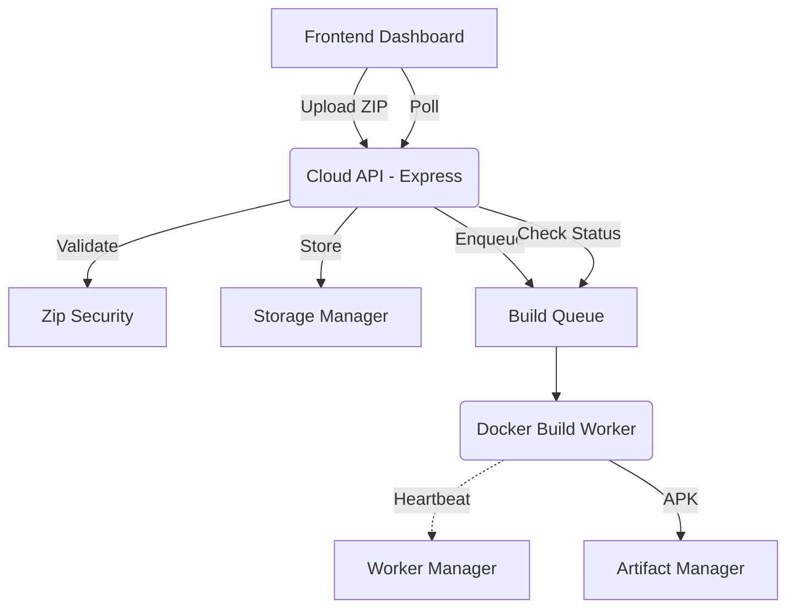

# Cloud Build Platform Architecture

## Components

1. **Frontend (React + Vite)**: Connects to backend API. Unchanged to maintain backwards compatibility.
2. **API Server (Express)**: Exposes endpoints for uploading, starting, and monitoring builds.
3. **Cloud Build Platform Managers (`src/server/cloud-build`)**:
   - `StorageManager`: Manages file system for workspace, uploads, artifacts, logs.
   - `ZipSecurity`: Validates ZIP uploads (ZipSlip prevention, dangerous file scanning).
   - `ArtifactManager`: Stores generated APKs and generates `metadata.json` (SHA256, duration).
   - `WorkerManager`: In-memory worker tracker supporting Heartbeats.
   - `RateLimiter`: Rate limits based on IP and max concurrent builds per user.
   - `DownloadManager`: Manages secure expiring tokens for artifact downloads.
4. **Worker Docker Container**: Runs securely isolated builds using Gradle.

## Architecture Diagram (Mermaid)

